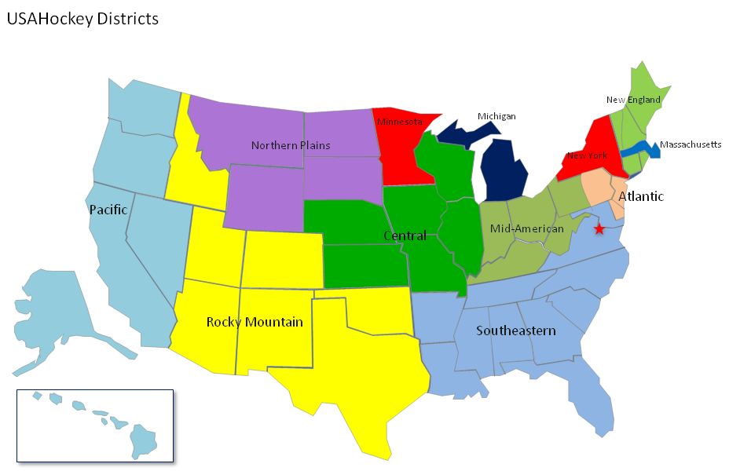

```{r setup, include=FALSE}
library(dplyr)
library(fastRhockey)
library(purrr)
library(sportyR)
library(ggplot2)
library(googlesheets4)
library(tidyverse)

```

### Background 

To get ready for the upcoming season, I looked at some membership data from USA hockey, available here: https://www.usahockey.com/membershipstats

It's all in PDFs but I cleaned it up a bit and put it [here.](https://docs.google.com/spreadsheets/d/13H064Dzao-s3RZ4Tx11pTt8PCMGikmxEjurpVVat6vQ/edit?usp=sharing)

Note, even in the initial PDF, there was no data for 6U females in the 2021 membership summary. 

Importing that data: 


```{r}
data <- rio::import("USA Hockey Numbers 2015-2024.xlsx", sheet="Hockey Membership")

```


How many people have registered over time?


```{r}
data %>% 
  filter(Gender=="A") %>% 
ggplot(aes(Season,`all ages`))+
  geom_col()+
  geom_text(aes(label = after_stat(y)), stat="summary", fun="sum",vjust=-0.5)+
  labs(title = "Number of people registered to play USA hockey")
```

How many girls and women registered over time? 


```{r}
data %>% 
  filter(Gender=="F") %>% 
ggplot(aes(Season,`all ages`))+
  geom_col()+
  geom_text(aes(label = after_stat(y)), stat="summary", fun="sum",vjust=-0.5)+
  labs(title = "Number of females registered to play USA hockey")
```


Transforming the data to a tidy format

```{r}
tidy_data <- data %>% 
  pivot_longer(cols=c(`all ages`,`19&over`,`17-18`,`15-16`,`13-14`,`11-12`,`9-10`,`7-8`,`6&U`),names_to = "age",values_to = "number")

tidy_data
```


Looking at growth in each district.

Note: Here is the map of each district 


```{r fig.width=20, fig.height=15}
tidy_data %>% 
  filter(Gender=="A") %>% 
  filter(age=="all ages") %>% 
ggplot(aes(Season,number, fill = District))+
  geom_col()+
  facet_wrap(~District, ncol=3)+
  theme(text = element_text(size = 20))+
  labs(title = "Number of people registered to play USA hockey")
```


Note, this puts each district on the same scale. 


Looking at growth in each district, without numbers relative to each other. (In other words, the computer picks the appropriate Y axis numbers here.)

```{r fig.width=20, fig.height=15}
tidy_data %>% 
  filter(Gender=="A") %>% 
  filter(age=="all ages") %>% 
ggplot(aes(Season,number, fill = District))+
  geom_col()+
  facet_wrap(~District, scales="free", ncol=3)+
  theme(text = element_text(size = 20))+
  labs(title = "Number of people registered to play USA hockey", caption = "Note different scales")
```


Looking at growth for girls in each district

```{r fig.height=15, fig.width=20}
tidy_data %>% 
  filter(Gender=="F") %>% 
  filter(age=="all ages") %>% 
ggplot(aes(Season,number, fill = District))+
  geom_col()+
  facet_wrap(~District,ncol=3)+
  theme(text = element_text(size = 20))+
  labs(title = "Number of females registered to play USA hockey")
```


Looking at growth for girls in each district, without numbers relative to each other

```{r fig.width=20, fig.height=15}
tidy_data %>% 
  filter(Gender=="F") %>% 
  filter(age=="all ages") %>% 
ggplot(aes(Season,number, fill = District))+
  geom_col()+
  facet_wrap(~District, scales="free", ncol=3)+
  theme(text = element_text(size = 20))+
  labs(title = "Number of females registered to play USA hockey", caption = "Note different scales")
```


How have age groups grown over time? 

```{r}
tidy_data %>% 
  filter(age!="all ages") %>% 
  filter(Gender=="A") %>% 
ggplot(aes(Season,number, fill = age))+
  geom_col()+
  facet_wrap(~age)+
  labs(title = "Number of people registered to play USA hockey by age group")
```


There are so many adults that this is a bit hard to read, so taking those out. 


```{r}
tidy_data %>% 
  filter(age!="all ages") %>% 
  filter(age!="19&over") %>% 
  filter(Gender=="A") %>% 
ggplot(aes(Season,number, fill = age))+
  geom_col()+
  facet_wrap(~age)+
  labs(title = "Number of people registered to play USA hockey")
```


Wow big drop off in high school actually. Though I have read that high school teams often do not also register for USA hockey. They have to register if they play in USA hockey event, but not for high school itself.


How does this look for girls?


```{r}
tidy_data %>% 
  filter(age!="all ages") %>% 
  filter(age!="19&over") %>% 
  filter(Gender=="F") %>% 
ggplot(aes(Season,number, fill = age))+
  geom_col()+
  facet_wrap(~age)+
  labs(title = "Number of females registered to play USA hockey")
```

Bit of a drop in Bantams. And the same high school drop we see above. 


What's the growth of women's hockey?


```{r}
tidy_data %>% 
  filter(age=="19&over") %>% 
  filter(Gender=="F") %>% 
ggplot(aes(Season,number, fill = age))+
  geom_col()+
  facet_wrap(~age)+
  geom_text(aes(label = after_stat(y)), stat="summary", fun="sum",vjust=-0.5)+
  labs(title = "Number of Women 19 and over who registered to play USA hockey")
```

How many female players are in each district?


```{r fig.width=20, fig.height=25}
tidy_data %>% 
  filter(age=="19&over") %>% 
  filter(Gender=="F") %>% 
ggplot(aes(Season,number, fill = age))+
  geom_col()+
    facet_wrap(~District, ncol=3)+
  geom_text(aes(label = after_stat(y)), stat="summary", fun="sum",vjust=-0.5)+
  theme(text = element_text(size = 20))+
  labs(title = "Number of Women 19 and over who registered to play USA hockey")
  
```


Looking at Coach numbers.

This is not on their website, I got this from USA hockey. I asked for it and they emailed me. 

```{r}
coaches <-rio::import("USA Hockey Numbers 2015-2024.xlsx", sheet="coaches")%>% 
  mutate(total_coaches=Female+Male) %>% 
  mutate(percent_female_per_district_per_year=round(Female/total_coaches,2))


```

How many coaches are there per year? 


```{r}
total_coaches <- coaches %>% 
  group_by(Year) %>% 
  summarize(total=sum(total_coaches))

total_coaches %>% 
  ggplot(aes(Year,total))+
  geom_col()+
  geom_text(aes(label = after_stat(y)), stat="summary", fun="sum",vjust=-0.5)+
  labs(title="Number of USA Hockey coaches each year")
```

How many female coaches?


```{r}
female_coaches <- coaches %>% 
  group_by(Year) %>% 
  summarize(total=sum(Female))

female_coaches %>% 
  ggplot(aes(Year,total))+
  geom_col()+
  geom_text(aes(label = after_stat(y)), stat="summary", fun="sum",vjust=-0.5)+
  labs(title="Number of female USA Hockey coaches each year")
```


What percentage are female each year? 
```{r}
percent_female <- coaches %>% 
  group_by(Year) %>% 
  summarize(total=sum(total_coaches),total_female=sum(Female),percent_female=(total_female/total)) %>% 
  mutate(percent_female=round(percent_female,3))

percent_female %>% 
  ggplot(aes(Year,percent_female))+
  geom_col()+
  geom_text(aes(label = after_stat(y)), stat="summary", fun="sum",vjust=-0.5)+
  labs(title="Percent of female USA Hockey coaches each year")
```


What percent of all players are females? 

```{r}
tidy_data %>% 
  filter(age=="all ages") %>% 
  group_by(Season,Gender) %>% 
  summarize(total=sum(number)) %>% 
  pivot_wider(names_from = Gender,values_from = total) %>% 
  mutate(percent_female=`F`/`A`) %>% 
  ggplot(aes(Season,round(percent_female,2))) +
  geom_col()+
  geom_text(aes(label = after_stat(y)), stat="summary", fun="sum",vjust=-0.5)+
  labs(title="Percent of female USA Hockey players per year")
```


What is the percentage female in each district? 

```{r fig.width=20, fig.height=20}
coaches %>% 
  ggplot(aes(Year,percent_female_per_district_per_year, fill=District))+
  geom_col()+
  facet_wrap(~District,ncol=3)+
  geom_text(aes(label = after_stat(y)), stat="summary", fun="sum",vjust=-0.5)+
  theme(text = element_text(size = 20))+
  labs(title="Percent of female USA Hockey players per year")
```


So big variation here. In Minnesota and the Northern Plains, females are about one out of every ten coaches. (Which is still quite small!) In the Mid Am and Atlantic divisions though, it's less than one in twenty. Though in every place it has gone up over the last ten years.  


What percent of all players are females in each district? 

```{r fig.width=20, fig.height=20}

tidy_data %>% 
  filter(age!="all ages") %>% 
  group_by(Season,Gender,District) %>% 
  summarize(total=sum(number, na.rm = TRUE)) %>% 
  pivot_wider(names_from = Gender,values_from = total) %>% 
  mutate(percent_female=`F`/`A`) %>% 
  ggplot(aes(Season,round(percent_female,2))) +
  geom_col()+
  facet_wrap(~District,ncol=3)+
  geom_text(aes(label = after_stat(y)), stat="summary", fun="sum",vjust=-0.5)+
  theme(text = element_text(size = 25))+
  labs(title="Percent of female USA Hockey players per year")
```


Wow Massachusetts, New England, and Minnesota have almost double the percentage of some other places. 

Note that the above includes adults, though. Looking just at kids: 


```{r fig.height=25, fig.width=20}

tidy_data %>% 
  filter(age!="all ages") %>% 
  filter(age!="19&over") %>% 
  group_by(Season,Gender,District) %>% 
  summarize(total=sum(number, na.rm = TRUE)) %>% 
  pivot_wider(names_from = Gender,values_from = total) %>% 
  mutate(percent_female=`F`/`A`) %>% 
  ggplot(aes(Season,round(percent_female,2))) +
  geom_col()+
  facet_wrap(~District,ncol=3)+
  geom_text(aes(label = after_stat(y)), stat="summary", fun="sum",vjust=-0.5)+
  theme(text = element_text(size = 20))+
  labs(title="Percent of girls playing USA Hockey per year")
```


Wow I'm really surprised at how close these numbers are! Now looking at JUST adults: 


```{r fig.height=20, fig.width=25}

tidy_data %>% 
  filter(age=="19&over") %>% 
  group_by(Season,Gender,District) %>% 
  summarize(total=sum(number, na.rm = TRUE)) %>% 
  pivot_wider(names_from = Gender,values_from = total) %>% 
  mutate(percent_female=`F`/`A`) %>% 
  ggplot(aes(Season,round(percent_female,2))) +
  geom_col()+
  facet_wrap(~District, ncol=3)+
  geom_text(aes(label = after_stat(y)), stat="summary", fun="sum",vjust=-0.5)+
  theme(text = element_text(size = 20))+
  labs(title="Percent of women playing USA Hockey year")
```


#### Cohorts

How has each cohort grown? 


By cohort, I mean the same group of kids. 

For example, in 2015 the kids in 8U would be the same kids who are in 16U by 2023. I am labeling them cohort 1. Cohort 2 will be kids who are 7 or 8 in 2016. Cohort 3 will be kids 6 or under in 2015. Note: I know this could techincally include 3 or 4 year olds but in my experience few of them are in hockey.

I am going to label a few cohorts and see how they grow or shrink over time.

Here are the cohorts: 

* cohort 1: 8U in 15/16
* cohort 2: 8U in 16/17
* cohort 3: 6U in 15/16
* cohort 4: 10U in 15/16
* cohort 5: 12U in 16/17
* cohort 6: 6U in 16/17

We have to go every other year here since we don't know what proportion of each age group moves up each year. And of course this isn't perfect as kids can move districts!

```{r}
tidy_data <- tidy_data %>% 
  mutate(cohort=case_when(
    age=="7-8" & Season =="15-16" ~ "cohort 1",
    age=="9-10" & Season == "17-18" ~ "cohort 1",
    age=="11-12" & Season == "19-20" ~ "cohort 1",
    age=="13-14" & Season == "21-22" ~ "cohort 1",
    age=="15-16" & Season == "23-24" ~ "cohort 1",
        age=="7-8" & Season =="16-17" ~ "cohort 2",
    age=="9-10" & Season == "18-19" ~ "cohort 2",
    age=="11-12" & Season == "20-21" ~ "cohort 2",
    age=="13-14" & Season == "22-23" ~ "cohort 2",
    age=="6&U" & Season == "15-16" ~ "cohort 3",
        age=="7-8" & Season =="17-18" ~ "cohort 3",
    age=="9-10" & Season == "19-20" ~ "cohort 3",
    age=="11-12" & Season == "21-22" ~ "cohort 3",
    age=="13-14" & Season == "23-24" ~ "cohort 3",
    age=="9-10" & Season == "15-16" ~ "cohort 4",
    age=="11-12" & Season =="17-18" ~ "cohort 4",
    age=="13-14" & Season =="19-20" ~ "cohort 4",
    age=="15-16" & Season=="21-22" ~ "cohort 4",
    age=="17-18" & Season=="23-14" ~ "cohort 4",
    age=="11-12" & Season=="16-17" ~ "cohort 5",
    age=="13-14" & Season=="18-19" ~ "cohort 5",
    age=="15-16" & Season=="20-21" ~ "cohort 5",
    age=="17-18" & Season=="22-23" ~ "cohort 5",
    age=="6&U" & Season=="16-17" ~ "cohort 6",
    age=="7-8" & Season=="18-19" ~ "cohort 6",
    age=="9-10" & Season=="20-21" ~ "cohort 6",
    age=="11-12" & Season=="22-23" ~ "cohort 6",
.default = "unknown"
    
  ))


tidy_data
```


How does each change over time? 

```{r}
tidy_data %>% 
  filter(cohort=="cohort 1"|cohort== "cohort 2"|cohort=="cohort 3"|cohort=="cohort 4"|cohort=="cohort 5"|cohort=="cohort 6") %>% 
ggplot( aes(Season,number, fill = cohort))+
  geom_col()+
  facet_wrap(~cohort)+
  labs(title = "Number of kids playing USA hockey in various cohorts")
```


Big dips for cohorts 1, 4, and 5 at the end but they all have high school players. Cohort 3 was only 13 and 14 in 23/24 though and they still kept dipping. Even after Covid. 


How well do the cohorts do in each district? 


```{r}
Districts <- unique(tidy_data$District)

looking_at_cohorts <- function(Yo.District){
  tidy_data %>% 
  filter(District==Yo.District) %>% 
  filter(cohort=="cohort 1"|cohort== "cohort 2"|cohort=="cohort 3"|cohort=="cohort 4"|cohort=="cohort 5"|cohort=="cohort 6") %>% 
ggplot( aes(Season,number, fill = cohort))+
  geom_col()+
  facet_wrap(~cohort)+
  labs(title = paste("USA Hockey attendance numbers for \n various cohorts in the",Yo.District,"District"))
}

purrr::map(Districts,looking_at_cohorts)
```


Cohort 6 in particular can be rising or falling depending on where you are. 

Also interesting: some places don't seem to do much with 6U though it doesn't really affect them later. 


